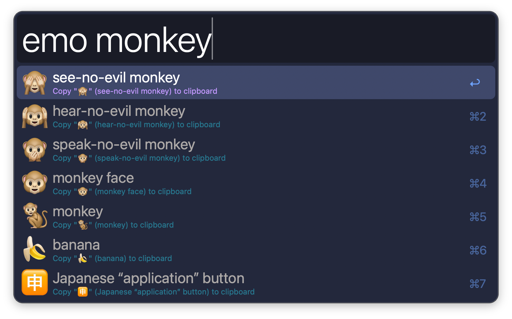
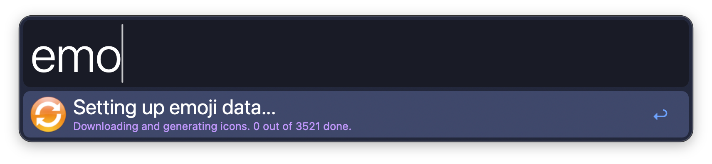
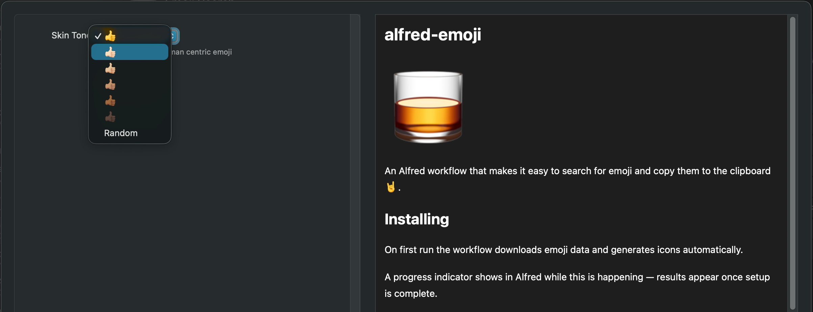

# alfred-emoji


An [Alfred workflow](https://alfredapp.com/) that makes it easy to search for
emoji and copy them to the clipboard 🤘.

Rewritten in Python, forked from the [original](https://github.com/jsumners/alfred-emoji)
by [James Sumners](https://github.com/jsumners).



## Installing

[Download the workflow from GitHub Releases][releases].

On first run the workflow downloads emoji data and generates icons automatically.
A progress indicator shows in Alfred while this is happening — results appear
once setup is complete.

The generated emoji data and icons are stored in Alfred's Workflow Data directory
(`~/Library/Application Support/Alfred/Workflow Data/com.github.ccaio.alfred-emoji/`).



## Usage

```bash
emo [query]
```

| Key | Action |
| --- | --- |
| ↵ return | Copy the emoji symbol (e.g. 🤣) to the clipboard |
| ⌥↵ alt+return | Copy the emoji code (e.g. `:rofl:`) to the clipboard |
| ⌃↵ ctrl+return | Copy the codepoint (e.g. `U+1F923`) to the clipboard |
| ⇧↵ shift+return | Copy the base symbol without skin tone modifier |

### Hotkey and snippet triggers

You can also trigger the workflow without typing the `emo` keyword:

- **Hotkey** — bind a keyboard shortcut in Alfred preferences. Activates the
  search directly, identical to typing the keyword.
- **Snippet** — configure a text snippet shortcut in Alfred preferences. When
  triggered this way, pressing ↵ **pastes** the emoji directly into the
  frontmost application instead of copying it to the clipboard.

### Skin tone

Set the `skin_tone` workflow variable in Alfred preferences:

| Value | Result |
| --- | --- |
| _(empty)_ | 👍 default |
| `0` | 👍🏻 |
| `1` | 👍🏼 |
| `2` | 👍🏽 |
| `3` | 👍🏾 |
| `4` | 👍🏿 |
| `random` | random tone each time |

The ⇧ modifier always copies the base symbol regardless of the skin tone setting.



## Automatic Updates

The workflow checks for new releases once per week and installs them
automatically. All downloads come from [GitHub releases][releases].

Emoji data is also kept up to date: the workflow checks [emojilib](https://github.com/muan/emojilib)
and [unicode-emoji-json](https://github.com/muan/unicode-emoji-json) for
upstream changes weekly and regenerates icons when new emoji are published.

## Building

Requires Python 3.9.6 or later. Install dev dependencies first:

```bash
pip install -r requirements.txt
```

Then package the workflow:

```bash
python packager.py <version>             # creates alfred-emoji-<version>.alfredworkflow
python packager.py <version> --release   # also publishes a GitHub release via gh CLI
```

## License

[MIT License](http://kylebelt.mit-license.org/)

[releases]: https://github.com/kylebelt/alfred-emoji/releases
